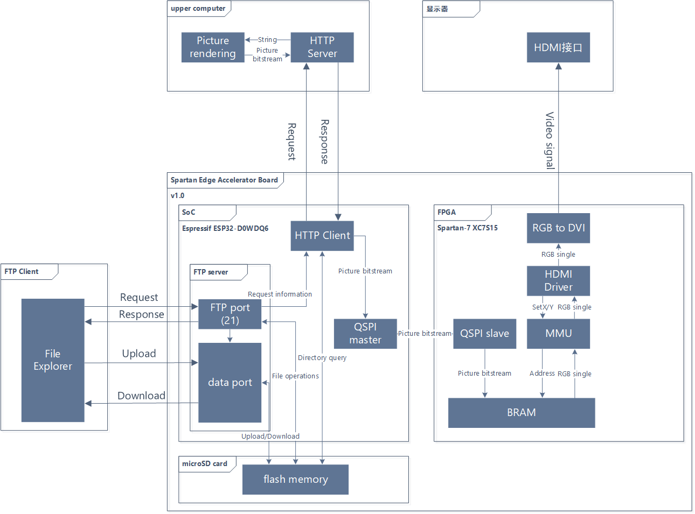
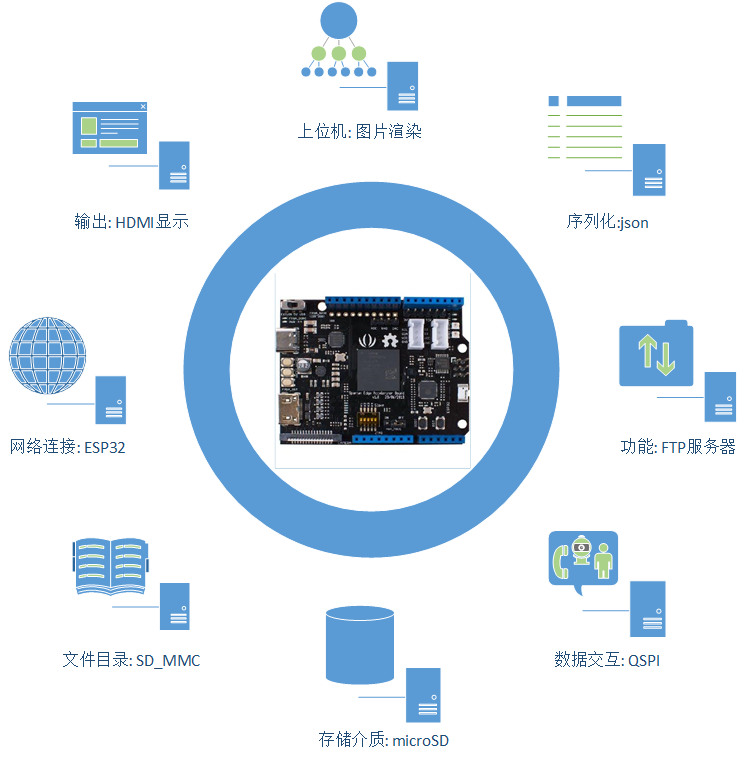
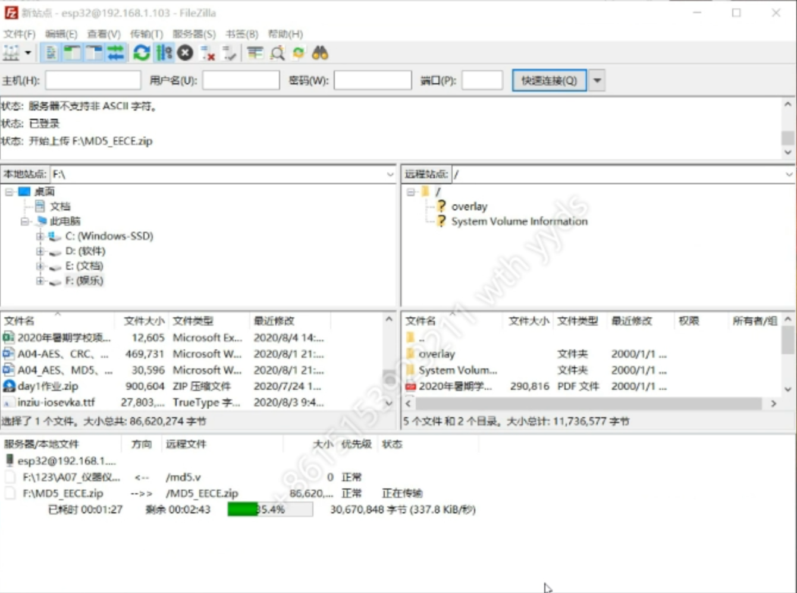
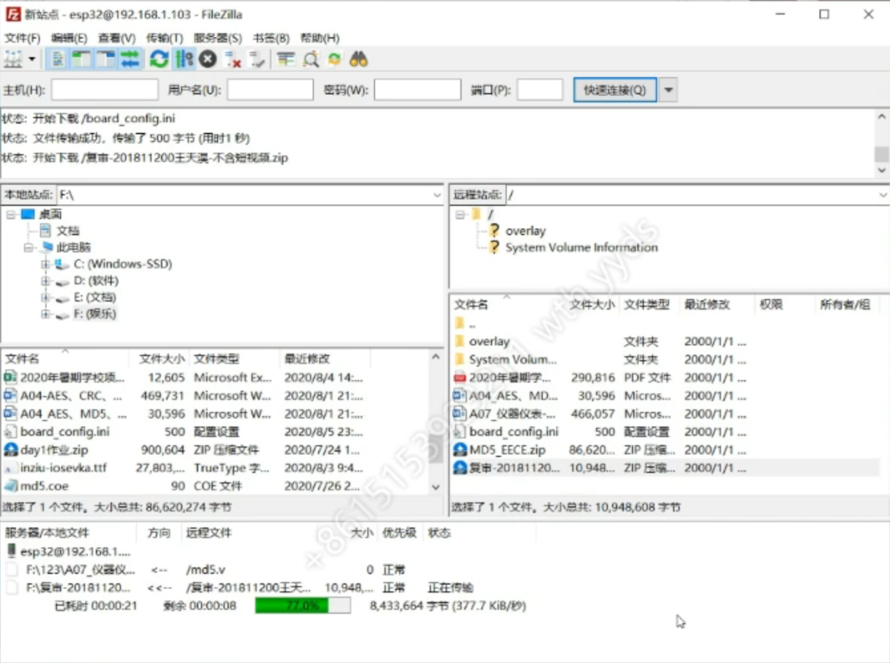
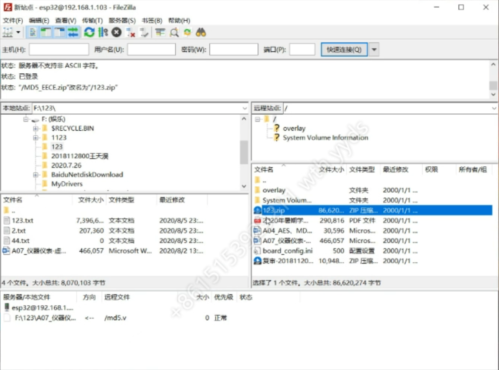
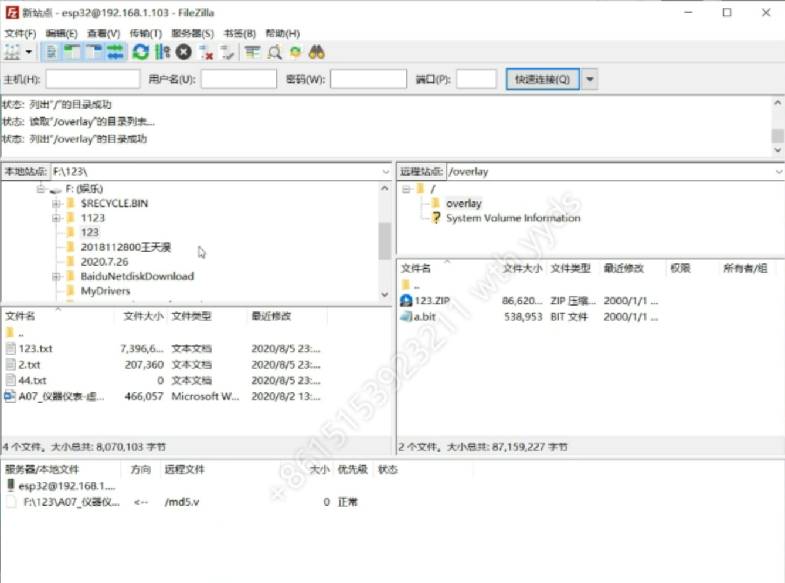
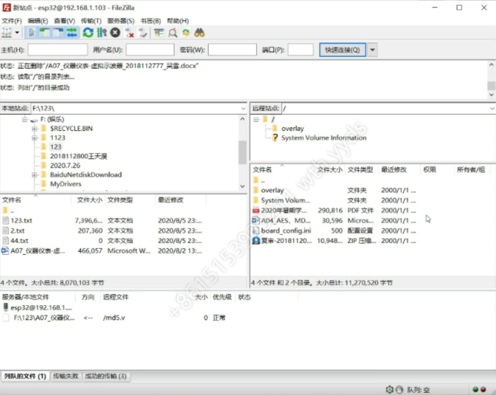
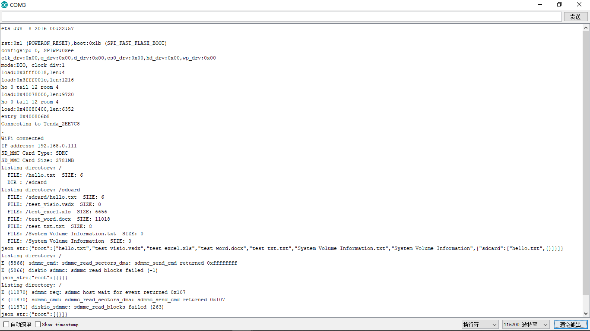
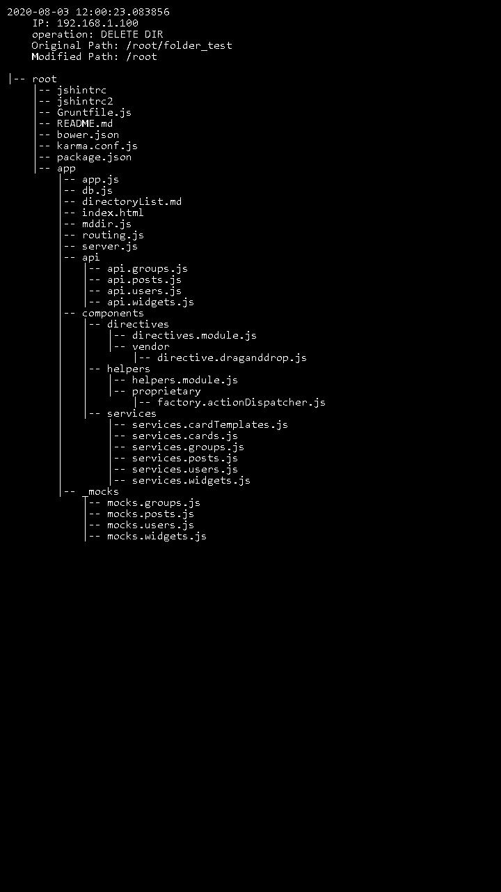

# 项目名称: &nbsp; **FTP Server for SEA**

## 2020年新工科联盟-Xilinx暑期学校（Summer School）项目

## 项目简介

本项目基于挂载microSD闪存卡的<abbr title="Spartan Edge Accelerator Board">SEA</abbr>开发板, 目标为将项目[ESP32_FTPServer_SD_MMC]([spartan-edge-esp32-boot](https://github.com/Pillar1989/spartan-edge-esp32-boot))移植到SEA平台并再此基础上添加新的功能与特性

### 项目功能

* ESP32: 
  - 实现可以为局域网提供服务的FTP服务器
  - 对SD卡的文件目录结构进行实时扫描
  - 将扫描结果与文件操作信息通过HTTP请求发送至上位机
  - 读取上位机的比特流响应
  - 将比特流通过<abbr title="Quad SPI">QSPI</abbr>写入Spartan-7的RAM,
* 上位机:
  - 对SEA通过HTTP请求发送的信息渲染成图片, 并对图片进行压缩后以比特流的形式响应
* Spartan-7:
  - QSPI从机接收ESP32发送的关于图像的bitstream
  - 对图像信息进行解码
  - 将解码后的图片信息输出至HDMI接口

## 项目团队名称: &nbsp; **肝×ULLONG_MAX**

## 项目团队成员

* 石博昊
* 卢禹良

## 项目开发工具

* Vivado v2018.3 (64-bit) &nbsp; \[[下载](https://china.xilinx.com/support/download/index.html/content/xilinx/zh/downloadNav/vivado-design-tools/2018-3.html)]
    - SW Build: 2405991 on Thu Dec 6 23:38:27 MST 2018 
    - IP Build: 2404404 on Fri Dec 7 01:43:56 MST 2018
* Arduino IDE V1.8.13 &nbsp; \[[下载](https://www.arduino.cc/en/Main/Software)]

## 项目测试工具

* Postman v7.29.1 &nbsp; \[[下载](https://www.postman.com/downloads/)]
* sokit v1.3.20150507 &nbsp; \[[下载](https://github.com/sinpolib/sokit)]
* FileZilla Client v3.49.1 (64-bit) &nbsp; \[[下载](https://filezilla-project.org/)]

## 项目依赖项

* [spartan-edge-esp32-boot](https://github.com/Pillar1989/spartan-edge-esp32-boot)
* [sea_esp32_qspi](https://github.com/CutClassH/sea_esp32_qspi)
* [Arduino core for the ESP32](https://github.com/espressif/arduino-esp32)
* [ArduinoJson](https://github.com/bblanchon/ArduinoJson)
* [SEA-FPGA-IP](https://github.com/DoneSEA/SEA/tree/master/Examples/FPGA-IP)

## 项目系统框图

## 项目技术路线

## 板卡型号

### Spartan Edge Accelerator Board v1.0 &nbsp; \[[详情](https://wiki.seeedstudio.com/cn/Spartan-Edge-Accelerator-Board/)]  \[[示例](https://github.com/DoneSEA/SEA)]

> #### FPGA 	
> 
> | 参数                               | 数值             |
> | ---------------------------------- | ---------------- |
> | FPGA芯片                           | Spartan-7 XC7S15 |
> | 逻辑单元                           | 12, 800          |
> | Slics                              | 2000             |
> | CLB触发器                          | 16, 000          |
> | 高大分散内存 (Kb)                  | 150              |
> | 模块内存/FIFO w / ECC (36 kb each) | 10               |
> | 总内存 (Kb)                        | 360              |
> | 时钟管理 (1 MMCM + 1 PLL)          | 2                |
> | DSP Slices                         | 20               |
> 
> #### 无线 	
> 
> | 参数     | 数值                   |
> | -------- | ---------------------- |
> | 无线芯片 | Espressif ESP32-D0WDQ6 |
> | WiFi     | 802.11 b/g/n 2.4GHz    |
> | 蓝牙     | Bluetooth 4.1 with BLE |
> 
> #### 外围设备 	
> 
> | 参数              | 数值                                               |
> | ----------------- | -------------------------------------------------- |
> | 视频              | Mini HDMI x1                                       |
> | 相机              | CSI/MIPI接口 x1 (兼容Raspberry Pi相机 V1 - OV5640) |
> | SD卡              | Micro SD/TF卡槽 x1                                 |
> | FPGA GPIO         | 10针头 (IO9~IO0)                                   |
> | Arduino GPIO      | 32针头(Arduino form factor)                        |
> | Grove             | Grove连接头 x2 (I2C/D2)                            |
> | LED               | Monochrome LED x2                                  |
> | RGB               | LED x2                                             |
> | 按钮              | 启动 x1                                            |
> | 重置              | x1                                                 |
> | FPGA重置          | x1                                                 |
> | 用户              | x2                                                 |
> | 开关              | 电源模式开关x1                                     |
> | 5通道DIP开关      | x1                                                 |
> | 供电              |                                                    |
> | 工作电压          | 5V                                                 |
> | 输入输出电压      | 5V                                                 |
> | 供电模式          | USB Type C 5V                                      |
> | VIN               | 8~17V                                              |
> | Arduino Micro USB | 5V                                                 |
> 
> #### 其他 	
> 
> | 参数             | 数值          |
> | ---------------- | ------------- |
> | ADC              | 8位 ADC1173   |
> | 加速度计和陀螺仪 | 6轴 LSM6DS3TR |

## 仓库目录结构

| 文件目录                                                                | 备注                      |
| ----------------------------------------------------------------------- | ------------------------- |
| \|-- README.md                                                          | 项目介绍                  |
| \|-- LICENSE                                                            | 开源协议                  |
| \|-- doc                                                                | 项目相关文档              |
| &nbsp;&emsp; \|-- 技术路线.vsdx                                         | Visio设计文件             |
| &nbsp;&emsp; \|-- 系统框图.vsdx                                         | Vison设计文件             |
| \|-- images                                                             | 项目图片                  |
| &nbsp;&emsp; \|-- 技术路线.png                                          | 技术路线                  |
| &nbsp;&emsp; \|-- 屏幕显示.jpg                                          | 屏幕显示                  |
| &nbsp;&emsp; \|-- 文件目录序列化.png                                    | 文件目录序列化            |
| &nbsp;&emsp; \|-- 文件删除.png                                          | 文件删除                  |
| &nbsp;&emsp; \|-- 文件上传.png                                          | 文件上传                  |
| &nbsp;&emsp; \|-- 文件下载.png                                          | 文件下载                  |
| &nbsp;&emsp; \|-- 文件移动.png                                          | 文件移动                  |
| &nbsp;&emsp; \|-- 文件重命名.png                                        | 文件重命名                |
| &nbsp;&emsp; \|-- 系统框图.png                                          | 系统框图                  |
| \|-- ExecutableFiles                                                    | 项目可执行文件            |
| &nbsp;&emsp; \|-- EFIT.bit                                              | FPGA接收并显示图片        |
| \|-- Sourcecode                                                         | 项目源码                  |
| &nbsp;&emsp; \|-- EFIT_1.1                                              | vivado工程-接收并显示图片 |
| &nbsp;&emsp; \|-- FTPServer_code                                        | FTP服务器项目             |
| &nbsp;&emsp; &nbsp;&emsp; &nbsp;&emsp; \|-- ESP32_FTPServer_SD_test.ino | FTP服务器项目文件         |
| &nbsp;&emsp; &nbsp;&emsp; &nbsp;&emsp; \|-- ESP32FtpServer.cpp          | FTP服务器源文件           |
| &nbsp;&emsp; &nbsp;&emsp; &nbsp;&emsp; \|-- ESP32FtpServer.h            | FTP服务器头文件           |
| &nbsp;&emsp; &nbsp;&emsp; &nbsp;&emsp; \|-- log                         | FTP服务器测试日志信息     |
| &nbsp;&emsp; \|-- lower_computer                                        | 下位机                    |
| &nbsp;&emsp; &nbsp;&emsp; \|-- .clang-format                            | 代码格式规范              |
| &nbsp;&emsp; &nbsp;&emsp; \|-- ESP32_FTPServer_SD_test                  | FTP服务器测试项目         |
| &nbsp;&emsp; &nbsp;&emsp; &nbsp;&emsp; \|-- ESP32_FTPServer_SD_test.ino | FTP服务器测试项目文件     |
| &nbsp;&emsp; &nbsp;&emsp; &nbsp;&emsp; \|-- ESP32FtpServer.cpp          | FTP服务器源文件           |
| &nbsp;&emsp; &nbsp;&emsp; &nbsp;&emsp; \|-- ESP32FtpServer.h            | FTP服务器头文件           |
| &nbsp;&emsp; &nbsp;&emsp; \|-- HTTP_test                                | HTTP测试项目              |
| &nbsp;&emsp; &nbsp;&emsp; &nbsp;&emsp; \|-- HTTP_test.ino               | HTTP测试项目文件          |
| &nbsp;&emsp; &nbsp;&emsp; \|-- POST_test                                | POST请求测试项目          |
| &nbsp;&emsp; &nbsp;&emsp; &nbsp;&emsp; \|-- POST_test.ino               | POST请求测试项目文件      |
| &nbsp;&emsp; &nbsp;&emsp; \|-- SDMMC_test                               | SD_MMC测试项目            |
| &nbsp;&emsp; &nbsp;&emsp; &nbsp;&emsp; \|-- SDMMC_test.ino              | SD_MMC测试项目文件        |
| &nbsp;&emsp; \|-- upper_computer                                        | 上位机 (Django项目)       |
| &nbsp;&emsp; &nbsp;&emsp; \|-- API.md                                   | API接口描述文件           |
| &nbsp;&emsp; &nbsp;&emsp; \|-- db.sqlite3                               | 项目数据库文件            |
| &nbsp;&emsp; &nbsp;&emsp; \|-- form.jsonc                               | 格式化示例文件            |
| &nbsp;&emsp; &nbsp;&emsp; \|-- manage.py                                | 项目控制文件              |
| &nbsp;&emsp; &nbsp;&emsp; \|-- requirements.txt                         | 环境依赖描述文件          |
| &nbsp;&emsp; &nbsp;&emsp; \|-- response.bit                             | 响应体示例文件            |
| &nbsp;&emsp; &nbsp;&emsp; \|-- temp.jpg                                 | 图片渲染结果              |
| &nbsp;&emsp; &nbsp;&emsp; \|-- .idea                                    | PyCharm工程配置           |
| &nbsp;&emsp; &nbsp;&emsp; \|-- server                                   | Django 图片渲染App        |
| &nbsp;&emsp; &nbsp;&emsp; \|-- upper_computer                           | Django 项目管理App        |

## FTP服务器指令及响应码

请求指令|功能|请求参数|响应码
-|-|-|-
USER|用户|服务用户名|331: 用户名验证成功 500: 为验证用户, 其他指令无效 530: 用户名无效
PASS|密码|服务密码|230: 密码验证成功 500: 未验证密码, 其他指令无效 530: 密码无效
CDUP|回到上一层目录|无|250: 成功/失败返回根目录
CWD|改变工作目录|新的工作目录路径|250: 成功 550: 参数长度过长 501: 参数不存在 550: 目标无法访问
PWD|返回当前工作目录|无|257: 当前目录
QUIT|退出登录|无|221: 关闭控制连接
MODE|传输模式|S/B/C (仅支持’S’流传输)|200: 传输模式受支持 504: 传输模式不支持
PASV|被动接收请求|无|227: 进入被动模式
PORT|数据端口|客户端IP与端口|200: 数据连接成功建立 501: 无法解析请求参数
STRU|文件结构设置|F/R/P (仅支持’F’文件)|200: 文件结构受支持 504: 文件结构不支持
TYPE|表示类型|A/E/I (支持’A’ASCII与’I’Image)|200: 数据传输类型受支持 504: 数据传输类型不支持
ABOR|终止动作|无|226: 数据连接已关闭 426: 数据传输中止
DELE|删除|目标路径|250: 删除目标成功 450: 删除目标失败 500: 参数长度过长 501: 参数不存在 550: 目标无法访问
LIST|获取文件列表|无|150: 数据连接已建立 226: 数据传输完成 425: 数据连接无法建立 550: 目标无法访问
MLSD|获取文件信息列表|无|150: 数据连接已建立 226: 数据传输完成 425: 数据连接无法建立 550: 目标无法访问
NLST|获取目录列表|无|150: 数据连接已建立 226: 数据传输完成 425: 数据连接无法建立 550: 目标无法访问
NOOP|等待|无|200: 接收到请求
RETR|获得文件|目标路径|150: 数据连接已建立 226: 数据传输完成 425: 数据连接无法建立 450: 文件打开失败 500: 参数长度过长 501: 参数不存在 550: 目标无法访问
STOR|保存文件|目标路径|150: 数据连接已建立 226: 数据传输完成 425: 数据连接无法建立 451: 文件打开失败 500: 参数长度过长 501: 参数不存在
MKD|创建目录|目标路径|257: 目录创建成功 500: 参数长度过长 501: 参数不存在 521: 目标已存在 550: 目录创建失败
RMD|删除目录|目标路径|250: 目录删除成功 500: 参数长度过长 501: 参数不存在 550: 目录删除失败
RNFR|重命名/移动|目标路径|350: 重命名/移动已准备好 500: 参数长度过长 501: 参数不存在 550: 目标无法访问
RNTO|重命名为/移动至|目标路径|250: 重命名/移动成功 451: 重命名/移动文件失败 500: 参数长度过长 501: 参数不存在 553: 目标已存在
FEAT|获取高级功能支持|无|211: 系统答复
MDTM  (未实现)|获取文件修改时间|无|550: 未执行操作(功能未实现)
SIZE|获取文件大小|目标路径|213: 文件成功访问 450: 文件打开失败 500: 参数长度过长 501: 参数不存在

## 作品照片

### 文件上传

### 文件下载

### 文件重命名

### 文件移动

### 文件删除

### 文件目录序列化

### 屏幕显示

